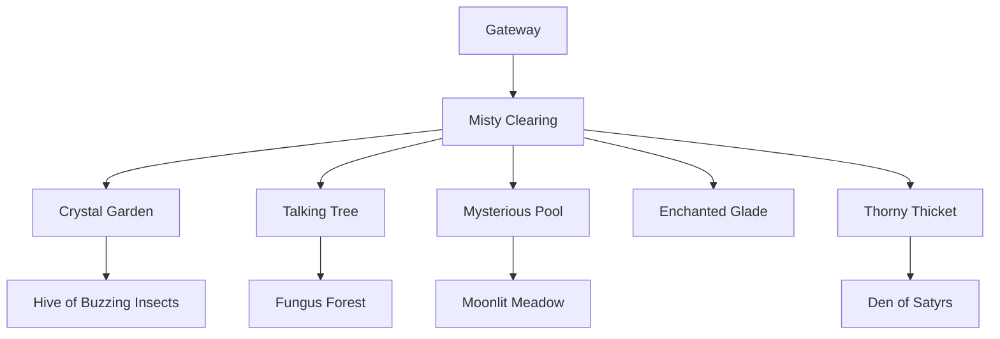

```mermaid 
graph TD
A[Gateway] --> B[Misty Clearing]
B --> C[Crystal Garden]
B --> D[Talking Tree]
B --> E[Mysterious Pool]
B --> F[Enchanted Glade]
B --> G[Thorny Thicket]
G --> H[Den of Satyrs]
C --> I[Hive of Buzzing Insects]
D --> J[Fungus Forest]
E --> K[Moonlit Meadow]

click A "Gateway: A magical portal leading into the Feywild. The party must solve a riddle to gain entry and access to the Misty Clearing. Pixies reside here and are willing to aid the party in exchange for help accessing the other side of the portal. Consequence of not helping the pixies is not gaining their trust and potentially facing challenges later in the journey."

click B "Misty Clearing: A beautiful clearing filled with mist and surrounded by tall trees. Various paths lead to different parts of the Feywild. The party must choose wisely in order to reach the heart of the forest and save the corrupted unicorn."

click C "Crystal Garden: A stunning garden filled with crystal trees and flowers. The garden is guarded by crystal elementals who will fiercely defend their home. The elementals may possess valuable information about the corruption of the heart of the forest."

click D "Talking Tree: A sentient tree that holds important knowledge of the Feywild and its inhabitants. The tree may provide clues to the party on their journey or offer assistance in exchange for a favor."

click E "Mysterious Pool: A calm and still pool surrounded by glowing mushrooms. The pool has the ability to show visions of the future, but be warned as the visions may not always be accurate."

click F "Enchanted Glade: A peaceful glade filled with light and happiness. The glade is home to several friendly fey creatures who may offer the party aid or simply provide a restful respite."

click G "Thorny Thicket: A dense and dangerous forest filled with thorns and brambles. The satyrs, led by the corrupted druid, reside here and pose a threat to the party's quest. The satyrs may hold information on the corruption of the heart of the forest and the party may choose to confront them in order to save the unicorn."

click H "Den of Satyrs: The lair of the satyrs and the corrupted druid. The party may choose to defeat the satyrs in combat or try to save the druid and heal the unicorn through non-violent means."

click I "Hive of Buzzing Insects: A dense colony of buzzing insects who may provide valuable resources for the party's journey. The insects are fiercely protective of their hive and will defend it if threatened."

click J "Fungus Forest: A forest filled with vibrant and glowing fungi. The fungus may have various magical properties and can be harvested for potions or spells. The forest is also home to mischievous fey creatures who may offer challenges or assistance to the party."

click K "Moonlit Meadow: A beautiful meadow bathed in moonlight. The meadow is home to fey creatures who dance and play under the moon's light. The creatures may offer the party aid or simply provide a moment of beauty and wonder."
```

#Arendur